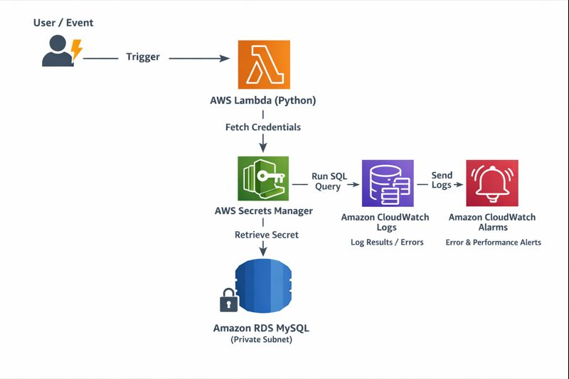

# AWS Advanced Hands-On Lab (Beginner → Advanced)
## RDS MySQL + Secrets Manager + Lambda (Python) + CloudWatch

---

## 1. Lab Objective

This lab teaches you **real-world AWS DevOps practices** using:

- Amazon RDS (MySQL)
- AWS Secrets Manager
- AWS Lambda (Python)
- Amazon CloudWatch Logs & Alarms

You will **secure credentials**, **automate database access**, and **monitor your application**.

---

## 2. Architecture Overview

User/Event  
→ AWS Lambda (Python)  
→ AWS Secrets Manager  
→ Amazon RDS MySQL  
→ CloudWatch Logs  
→ CloudWatch Alarms  

### Architecture Diagram


---

## 3. Prerequisites

- AWS Account
- Basic AWS Console knowledge
- No prior Python required

---

## 4. Phase 1 – Amazon RDS MySQL

### Step 2: Create Database

1. Go to **RDS → Create database**
2. Engine: **MySQL**
3. Template: **Free Tier**
4. DB Identifier:
   ```
   app-mysql-db
   ```
5. Credentials Settings
    - **Master username:** admin
    - **Credentials management:** Managed in AWS Secrets Manager - most secure
    - **Select the encryption key:** aws/secretsmanager (default)
6. Instance: `db.t3.micro`
7. Storage: 20 GB
8. Public access: **No**
9. Security Group:
   - Allow inbound **3306** from Lambda SG only

---


## 5. Phase 2 – AWS Secrets Manager

### Step 1: Create Secret

#### ✅ METHOD 1 RDS Automatically Creates and Manages Secrets Manager Secret (BEST & RECOMMENDED):

##### 📌 Overview: In this method, AWS automatically creates and manages a secret in AWS Secrets Manager during RDS MySQL database creation.

##### This happens when you select the option:

> **“Manage master credentials in AWS Secrets Manager”**

##### Note: This is an AWS-recommended best practice and is widely used in production environments.

##### 🧠 What This Method Means

##### Instead of manually creating:

- ✔ Database username

- ✔ Database password

- ✔ Secret JSON structure

##### AWS automatically:

- ✔ Generates the secret

- ✔ Stores credentials securely

- ✔ Keeps it synchronized with RDS

- ✔ Enables optional automatic rotation

#### How It Works

1. **You create an RDS MySQL database**
2. **You enable Secrets Manager integration**
3. **AWS automatically:**
    - Stores master username & password
    - Stores DB endpoint and port
    - Encrypts the secret using KMS
4. **Applications (Lambda, EC2, ECS) read credentials from Secrets Manager**

##### 📌 RDS does NOT read from Secrets Manager

###### Secrets Manager is for applications, not for RDS itself.

#### 🔍 Auto-Created Secret Structure (Example)

##### AWS creates a secret with this structure:

```
{
  "username": "admin",
  "password": "AutoGeneratedPassword",
  "engine": "mysql",
  "host": "app-mysql-db.xxxxxx.region.rds.amazonaws.com",
  "port": 3306,
  "dbname": "appdb"
}
```

- ✔ Automatically populated
- ✔ No manual input required
- ✔ Ready for Lambda or EC2 usage

#### 📍 Secret Location & Naming

##### The secret is created in AWS Secrets Manager with a name similar to:

```
rds-db-credentials/app-mysql-db
```

or

```
rds!db-ABCDEFG123
```

##### You can:

- Rename the secret

- Add tags

- Restrict IAM permissions

- Enable rotation

#### 🔁 Password Rotation Support

##### This method fully supports automatic password rotation:

- Secrets Manager generates a new password

- Updates RDS master password

- Updates the secret value

- Old password is invalidated

  - ✔ Secure
  - ✔ No hardcoding
  - ✔ Production-safe

#### 🐍 Using the Auto-Created Secret in Lambda (Python)

```
response = secrets_client.get_secret_value(
    SecretId="rds-db-credentials/app-mysql-db"
)

secret = json.loads(response["SecretString"])
```

##### Access values:

```
secret["username"]
secret["password"]
secret["host"]
secret["port"]
secret["dbname"]
```

#### 🎯 When to Use This Method

##### Use Method 3 when:

- One application uses one RDS database

- You want AWS-managed security

- You want automatic rotation

- You want minimal configuration errors

- You follow AWS best practices

#### ✅ Done.

---

#### ✅ METHOD 2 Create Secret Using RDS Integration  (Best & RECOMMENDED / MANUAL):

##### 📌 When to Use

- ✔ Production
- ✔ Beginner friendly
- ✔ Auto-sync with RDS
- ✔ Supports rotation easily

1. Open **AWS Console → Secrets Manager**
2. Click **Store a new secret**
3. Choose **Credentials for RDS database**

##### ✔ This tells AWS:

> **“This secret is for a database”**

4. Enter Credentials

##### Fill in:

```
| Field           | Value              |
| --------------- | ------------------ |
| Username        | admin              |
| Password        | StrongPassword123! |
| Database engine | MySQL              |
```
###### ⚠️ Must match RDS master username/password

5. Select RDS Database

##### ✔ AWS will automatically attach:

- DB endpoint

- Port

- Engine

6. Secret name:

###### Use a clean DevOps-style name:

   ```
   rds/mysql/app/credentials
   ```

7. (Optional) Rotation

For now:

```
Disable automatic rotation
```

8. **Store Secret :** Click Store

#### ✅ Done.

#### 🔎 What AWS Stores Internally (Auto JSON)

```json
{
  "username": "admin",
  "password": "StrongPassword123!",
  "engine": "mysql",
  "host": "app-mysql-db.xxxxxx.region.rds.amazonaws.com",
  "port": 3306,
  "dbname": "appdb"
}
```

###### 📌 This is exactly what Lambda reads.

---

#### ✅ METHOD 3 (ADVANCED / MANUAL):
##### Create Secret Manually (DevOps-Style)
##### 📌 When to Use

- ✔ Lambda labs
- ✔ Multi-DB environments
- ✔ Custom apps
- ✔ CI/CD pipelines

1. Open **AWS Console → Secrets Manager**
2. **Choose Secret Type:**  Other type of secret
3. Add Key-Value Pairs

##### Paste: 

```
{
  "username": "admin",
  "password": "StrongPassword123!",
  "host": "app-mysql-db.xxxxxx.region.rds.amazonaws.com",
  "port": 3306,
  "dbname": "appdb"
}
```

4. Secret Name:

###### Use a clean DevOps-style name:

```
rds/mysql/app/credentials
```

5. **Store Secret :** Click Store

6. **🧪 VERIFY SECRET (IMPORTANT)**

#### Steps

- Open the secret

- Click Retrieve secret value

- Confirm all fields are correct

**✔ This is what your Lambda code will read.**


#### 🐍 How Lambda Uses This Secret (Python Reminder)

```
response = secrets_client.get_secret_value(
    SecretId='rds/mysql/app/credentials'
)

secret = json.loads(response['SecretString'])
```
##### Then

```
secret['username']
secret['password']
secret['host']
secret['port']
secret['dbname']
```

##### 🚫 COMMON MISTAKES (VERY IMPORTANT)

```
| Mistake              | Result              |
| -------------------- | ------------------- |
| Wrong password       | DB connection fails |
| Wrong endpoint       | Timeout             |
| Lambda no permission | AccessDenied        |
| Port missing         | Connection error    |
| DB name missing      | Query failure       |
```

##### 🔐 IAM PERMISSION REQUIRED

##### Your Lambda must have:

```
{
  "Effect": "Allow",
  "Action": "secretsmanager:GetSecretValue",
  "Resource": "*"
}
```

###### Note: (Or restricted to that secret ARN)

#### ✅ Done.


#### ⚖️ Comparison with Other Methods

```
| Feature             | Method 1 (Auto-created) | Method 2 (RDS-integrated) | Method 3 (Manual) |
| ------------------- | ------------------------- | ----------------- | ----------------------- |
| AWS recommended     | ✅ Yes                     | ✅ Yes          | ⚠️ Depends                   |
| Manual effort       | ❌ No                      | ❌ No               | ✅ Yes                    |
| Auto rotation       | ✅ Easy                    | ✅ Easy             | ❌ Hard                  |
| Sync with RDS       | ✅ Yes                     | ✅ Yes              | ❌ No                   |
| Best for production | ✅ Yes                     | ✅ Yes          | ⚠️ Depends                   |
```

#### 🧠 Key Takeaway

> **Method 1 is the safest, cleanest, and most production-ready way to manage RDS credentials using AWS Secrets Manager.**
---

## 6. Phase 3 – IAM Role

### Step 3: Create IAM Role for Lambda

Permissions:
- AWSLambdaBasicExecutionRole
- SecretsManagerReadWrite

Purpose:
- Read secrets
- Write logs
- Access AWS services securely

---

## 7. Phase 4 – AWS Lambda (Python)

### Step 4: Create Lambda Function

- Name: `rds-mysql-automation`
- Runtime: **Python 3.10**
- Execution role: IAM role created earlier

---

## 8. Python Lambda Code

### Full Python Script

```python
import json
import boto3
import pymysql
import logging

logger = logging.getLogger()
logger.setLevel(logging.INFO)

secrets_client = boto3.client('secretsmanager')

def get_secret():
    response = secrets_client.get_secret_value(
        SecretId='rds/mysql/app/credentials'
    )
    secret = json.loads(response['SecretString'])
    return secret

def lambda_handler(event, context):
    secret = get_secret()

    connection = pymysql.connect(
        host=secret['host'],
        user=secret['username'],
        password=secret['password'],
        database=secret['dbname'],
        port=3306
    )

    with connection.cursor() as cursor:
        cursor.execute("SELECT NOW();")
        result = cursor.fetchone()

    logger.info(f"Database Time: {result}")
    connection.close()

    return {
        'statusCode': 200,
        'body': json.dumps('Success')
    }
```

---

## 9. Python Code Explanation

- `boto3`: AWS SDK for Python
- `pymysql`: MySQL client
- Secrets are fetched dynamically
- Logs automatically go to CloudWatch

---

## 10. Phase 5 – CloudWatch Logs

### View Logs

1. Open **CloudWatch → Log Groups**
2. Select:
   ```
   /aws/lambda/rds-mysql-automation
   ```

Logs show:
- DB connection success
- Query output
- Errors

---

## 11. Phase 6 – CloudWatch Alarms

### Create Alarm

Metric:
- Lambda Errors

Condition:
- Errors ≥ 1

Purpose:
- Detect DB failures
- Detect permission issues

---

## 12. Common Errors & Fixes

| Issue | Cause | Fix |
|-----|-----|-----|
| Timeout | Lambda not in VPC | Attach VPC |
| AccessDenied | IAM issue | Add SecretsManager permission |
| DB error | SG blocked | Allow port 3306 |

---

## 13. Advanced Practice Tasks

- Insert records using Lambda
- Enable secret rotation
- Add EventBridge trigger
- Use RDS Proxy
- Encrypt RDS with KMS

---

## 14. Final Notes

This lab represents **real DevOps production patterns**.

Skills gained:
- Secure automation
- Python cloud scripting
- AWS monitoring
- Database security

---

🎯 You are now practicing **professional AWS DevOps engineering**
