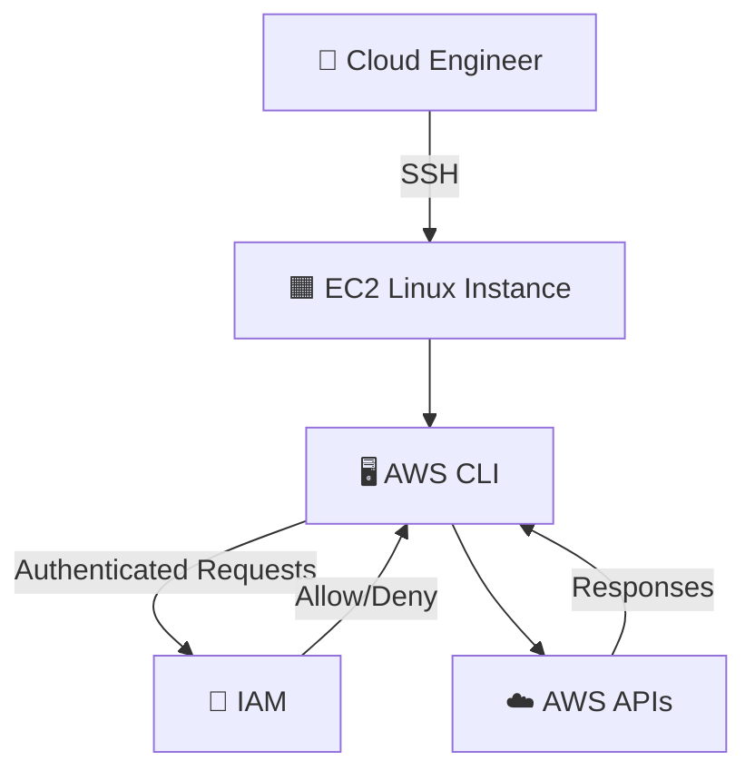

# AWS CLI, Linux & Bash Scripting Hands‑On Lab

> **Author:** AWS Cloud Trainer  
> **Level:** Advanced (Associate → Professional)  

---

## 1️⃣ Purpose

The purpose of this lab is to provide **hands-on, real‑world training** for beginners who want to become **professional AWS Cloud / DevOps engineers**.

This lab focuses on:

* Learning **AWS CLI from basic to advanced**
* Strengthening **Linux system administration skills**
* Building **Bash scripting skills (automation mindset)**
* Performing **daily operational tasks** commonly done by cloud engineers on AWS EC2

By the end of this lab, you will be comfortable working **without the AWS Console** and will rely on **CLI + scripts**, just like real professionals.

---

## 2️⃣ List of Tasks You Will Perform

### 🔹 Linux Fundamentals

* Navigate Linux directories
* Create, edit, and manage files
* Manage permissions and ownership
* Install packages using package managers

### 🔹 AWS CLI Configuration

* Install AWS CLI on EC2
* Configure AWS CLI using IAM credentials
* Verify identity using STS

### 🔹 IAM Management (CLI)

* List IAM users
* Create IAM users
* Attach managed policies
* Generate access keys
* Understand least‑privilege access

### 🔹 EC2 Operations (CLI)

* List EC2 instances
* Start and stop EC2 instances
* Describe instance status
* Perform cost‑control operations

### 🔹 Bash Scripting

* Create and execute Bash scripts
* Use variables and loops
* Combine Bash with AWS CLI
* Automate EC2 management tasks
* Implement logging and basic error handling

---

## 3️⃣ Skills You Will Learn or Improve

After completing this lab, you will gain:

### ☁️ AWS Skills

* AWS CLI mastery
* IAM security fundamentals
* EC2 lifecycle management
* AWS automation mindset

### 🐧 Linux Skills

* Linux file system navigation
* User and permission management
* Package installation
* Process execution

### 🧠 DevOps / Automation Skills

* Bash scripting (basic → intermediate)
* Automation of repetitive cloud tasks
* Script logging and error handling
* Production‑style scripting practices

---

## 4️⃣ Lab Scenario (Real‑World Context)

### 🏢 Company Scenario

You have joined a **small‑to‑medium IT services company** as a **Junior Cloud Engineer**.

Your responsibilities include:

* Managing EC2 servers
* Creating IAM users for developers
* Controlling AWS costs by stopping unused instances
* Automating daily operational tasks using scripts

### 🎯 Business Requirement

The company wants:

* Less manual work via AWS Console
* Secure IAM access management
* Faster operations using AWS CLI
* Repeatable automation using Bash scripts

This lab simulates **exactly what you will do in your first real cloud job**.

---

## 5️⃣ Network Architecture Overview

### 🔹 Architecture Components

* **IAM User**: Used to authenticate AWS CLI
* **AWS CLI**: Installed on EC2 for automation
* **EC2 Instance**: Linux server where tasks are executed
* **AWS API**: Backend services accessed via CLI

### 🔹 Traffic Flow

1. User logs into EC2 via SSH
2. AWS CLI sends API requests
3. IAM validates permissions
4. AWS services (EC2, IAM) respond

---

## 6️⃣ AWS Official Symbols – Visual Architecture Diagram

> Diagram below represents a **real‑world AWS CLI‑based operations workflow** using standard AWS service components.



### 📝 Diagram Explanation

* **Cloud Engineer** connects to EC2 using SSH
* **AWS CLI** runs inside EC2
* **IAM** validates permissions
* **AWS APIs** execute requested operations

This architecture is widely used in:

* DevOps environments
* Automation servers
* CI/CD pipelines
* Production cloud operations

---

## ✅ Lab Completion Outcome

Once completed, you will be able to confidently say:

> “I can manage AWS using CLI, automate tasks with Bash, and work like a real cloud engineer.”

---

### 🚀 Next Labs (Optional Progression)

* AWS CLI + S3 automation
* IAM Roles & Instance Profiles
* CloudWatch monitoring via CLI
* Cron jobs + Bash + AWS
* Mini DevOps project

👉 *Ready to continue whenever you are.*

---

🧱 SECTION 0 — Prerequisites (Very Important)

##### 🔹 What you need before starting

- **AWS Account**

- **One EC2 Linux instance (Amazon Linux 2 or Amazon Linux 2023)**

- **IAM User with Programmatic Access**

- **AWS CLI installed on EC2**

---

## 🧱 SECTION 1 — Linux Basics (Foundation)

Before touching AWS CLI, you must feel comfortable with Linux.

### 🔹 Task 1.1 — Check system info

#### 1️⃣ Shows OS kernel and architecture

```
uname -a
```

#### 📌 Why:

**👉 Used in real jobs to identify OS**

#### 2️⃣ Shows Linux distribution

```
cat /etc/os-release
```

#### 📌 Why:

**👉 Important when installing packages**


### 🔹 Task 1.2 — File & directory navigation

#### 1️⃣ Shows current Working Directory

```
pwd
```

#### 2️⃣ Lists files (human readable sizes)

```
ls
```

```
ls -l
```

```
ls -lh
```

#### 3️⃣ Change directory

```
cd /home/ec2-user
```

### 🔹 Task 1.3 — Create files & directories

```
mkdir aws-training
```

```
cd aws-training
```

```
touch notes.txt
```

###### 📌 Real-life: You’ll always organize scripts, logs, configs.


### 🔹 Task 1.4 — View and edit files


```
cat notes.txt
```


```
echo "Learning AWS CLI" >> notes.txt
```


```
nano notes.txt
```

###### 📌 Why: Editing config files is daily cloud work.


---


## 🧱 SECTION 2 — AWS CLI Setup (Critical Step)


### 🔹 Task 2.1 — Install AWS CLI (Amazon Linux)


```
sudo yum install aws-cli -y
```

Verify:

```
aws --version
```

###### 📌 Why: AWS CLI = automation + speed + scripting

### 🔹 Task 2.2 — Configure AWS CLI

```
aws configure
```

#### You will enter:

- **Access Key**

- **Secret Key**

- **Region (example: us-east-1)**

- **Output format: json**

###### 📌 Real-life: Every server, CI/CD pipeline, automation uses this.

### 🔹 Test configuration

```
aws sts get-caller-identity
```

###### 📌 Why:

```
Confirms:

1. Who you are

2. Which account

3. IAM role or user
```

---

## 🧱 SECTION 3 — IAM via AWS CLI (Professional Daily Task)

### 🔹 Task 3.1 — List IAM users

```
aws iam list-users
```

###### 📌 Real-life: Admins verify users & access.

### 🔹 Task 3.2 — Create IAM user (CLI way)

```
aws iam create-user --user-name dev-user1
```

###### 📌 Why: Creating users for developers, tools, scripts.

### 🔹 Task 3.3 — Attach policy to user

```
aws iam attach-user-policy \
--user-name dev-user1 \
--policy-arn arn:aws:iam::aws:policy/AmazonEC2ReadOnlyAccess
```

###### 📌 Why: Least privilege principle.

### 🔹 Task 3.4 — Create access keys for user

```
aws iam create-access-key --user-name dev-user1
```

###### 📌 Important: Save output securely.

---

## 🧱 SECTION 4 — EC2 Management via AWS CLI

### 🔹 Task 4.1 — List EC2 instances

```
aws ec2 describe-instances
```

#### 👉 Large output, so filter:

```
aws ec2 describe-instances \
--query "Reservations[].Instances[].InstanceId" \
--output table
```

###### 📌 Why: Engineers never scroll raw JSON in real jobs.


### 🔹 Task 4.2 — Start EC2 instance

```
aws ec2 start-instances --instance-ids i-1234567890abcdef0
```

### 🔹 Task 4.3 — Stop EC2 instance

```
aws ec2 stop-instances --instance-ids i-1234567890abcdef0
```

###### 📌 Real-life: Cost optimization daily task.

### 🔹 Task 4.4 — Describe instance status

```
aws ec2 describe-instance-status
```

---

## 🧱 SECTION 5 — Bash Scripting (Beginner)

### 🔹 Task 5.1 — First Bash script

#### Create file:

```
nano hello.sh
```

#### Add:

```
#!/bin/bash
echo "Hello AWS Student"
date
whoami
```

#### Make executable:

```
chmod +x hello.sh
```

#### Run:

```
./hello.sh
```


###### 📌 Why: Bash = automation backbone.

---

## 🧱 SECTION 6 — Bash + AWS CLI (REAL POWER)

### 🔹 Task 6.1 — Script to list EC2 instances

```
nano list-ec2.sh
```

```
#!/bin/bash
echo "Listing EC2 Instances..."
aws ec2 describe-instances \
--query "Reservations[].Instances[].InstanceId" \
--output table
```

#### Run:

```
chmod +x list-ec2.sh
./list-ec2.sh
```

###### 📌 Real-life: This is how monitoring & ops scripts start.

---

## 🧱 SECTION 7 — Automation Script (Intermediate)

### 🔹 Task 7.1 — Stop all EC2 instances

```
nano stop-all-ec2.sh
```

```
#!/bin/bash

INSTANCES=$(aws ec2 describe-instances \
--query "Reservations[].Instances[].InstanceId" \
--output text)

for i in $INSTANCES
do
  echo "Stopping instance $i"
  aws ec2 stop-instances --instance-ids $i
done
```

###### 📌 Why: Mass operations = real DevOps work.

---

## 🧱 SECTION 8 — Logging & Error Handling (Advanced Bash)

```
#!/bin/bash

LOGFILE="/var/log/ec2-script.log"

echo "Script started at $(date)" >> $LOGFILE

if aws ec2 describe-instances >> $LOGFILE 2>&1
then
  echo "EC2 fetch success" >> $LOGFILE
else
  echo "Error fetching EC2" >> $LOGFILE
fi
```
###### 📌 Why: Production scripts must log.

---

## 🧱 SECTION 9 — Real-World Skills You’re Building

#### By completing this path, you are learning:

**✅ AWS CLI**

**✅ Linux administration**

**✅ IAM security**

**✅ EC2 operations**

**✅ Bash scripting**

**✅ Automation mindset**

**✅ Production-style workflows**


**END OF LAB**

