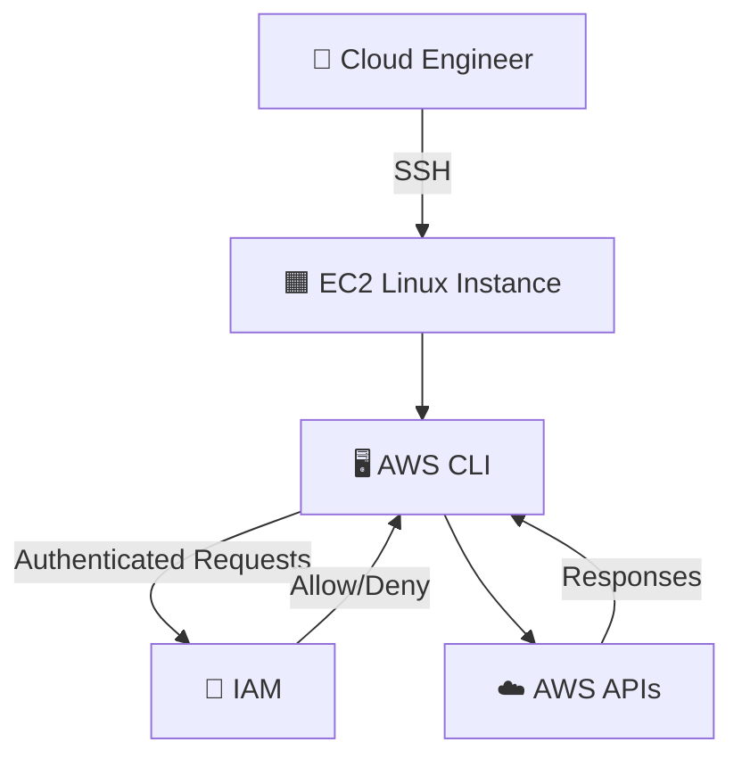

# AWS CLI, REDHAT & Bash Scripting Hands‑On Lab

> **Author:** AWS Cloud Trainer 

> **Level:** Advanced (Associate → Professional)

> **OS:** Red Hat Enterprise Linux (RHEL 8/9)

> **Focus:** AWS CLI + Linux + Bash + Security + Automation

> **Mode:** 100% CLI (No GUI dependency)

---

## 1️⃣ Purpose

The purpose of this lab is to provide **hands-on, real‑world training** for beginners who want to become **professional AWS Cloud / DevOps engineers**.

This lab focuses on:

* Learning **AWS CLI from basic to advanced**
* Strengthening **Linux system administration skills**
* Building **Bash scripting skills (automation mindset)**
* Performing **daily operational tasks** commonly done by cloud engineers on AWS EC2

By the end of this lab, you will be comfortable working **without the AWS Console** and will rely on **CLI + scripts**, just like real professionals.

---

## 2️⃣ List of Tasks You Will Perform

### 🔹 Linux Fundamentals

* Navigate Linux directories
* Create, edit, and manage files
* Manage permissions and ownership
* Install packages using package managers

### 🔹 AWS CLI Configuration

* Install AWS CLI on EC2
* Configure AWS CLI using IAM credentials
* Verify identity using STS

### 🔹 IAM Management (CLI)

* List IAM users
* Create IAM users
* Attach managed policies
* Generate access keys
* Understand least‑privilege access

### 🔹 EC2 Operations (CLI)

* List EC2 instances
* Start and stop EC2 instances
* Describe instance status
* Perform cost‑control operations

### 🔹 Bash Scripting

* Create and execute Bash scripts
* Use variables and loops
* Combine Bash with AWS CLI
* Automate EC2 management tasks
* Implement logging and basic error handling

---

## 3️⃣ Skills You Will Learn or Improve

After completing this lab, you will gain:

### ☁️ AWS Skills

* AWS CLI mastery
* IAM security fundamentals
* EC2 lifecycle management
* AWS automation mindset

### 🐧 Linux Skills

* Linux file system navigation
* User and permission management
* Package installation
* Process execution

### 🧠 DevOps / Automation Skills

* Bash scripting (basic → intermediate)
* Automation of repetitive cloud tasks
* Script logging and error handling
* Production‑style scripting practices

---

## 4️⃣ Lab Scenario (Real‑World Context)

### 🏢 Company Scenario

You have joined a **small‑to‑medium IT services company** as a **Junior Cloud Engineer**.

Your responsibilities include:

* Managing EC2 servers
* Creating IAM users for developers
* Controlling AWS costs by stopping unused instances
* Automating daily operational tasks using scripts

### 🎯 Business Requirement

The company wants:

* Less manual work via AWS Console
* Secure IAM access management
* Faster operations using AWS CLI
* Repeatable automation using Bash scripts

This lab simulates **exactly what you will do in your first real cloud job**.

---

## 5️⃣ Network Architecture Overview

### 🔹 Architecture Components

* **IAM User**: Used to authenticate AWS CLI
* **AWS CLI**: Installed on EC2 for automation
* **EC2 Instance**: Linux server where tasks are executed
* **AWS API**: Backend services accessed via CLI

### 🔹 Traffic Flow

1. User logs into EC2 via SSH
2. AWS CLI sends API requests
3. IAM validates permissions
4. AWS services (EC2, IAM) respond

---

## 6️⃣ AWS Official Symbols – Visual Architecture Diagram

> Diagram below represents a **real‑world AWS CLI‑based operations workflow** using standard AWS service components.



### 📝 Diagram Explanation

* **Cloud Engineer** connects to EC2 using SSH
* **AWS CLI** runs inside EC2
* **IAM** validates permissions
* **AWS APIs** execute requested operations

This architecture is widely used in:

* DevOps environments
* Automation servers
* CI/CD pipelines
* Production cloud operations

---

## ✅ Lab Completion Outcome

Once completed, you will be able to confidently say:

> “I can manage AWS using CLI, automate tasks with Bash, and work like a real cloud engineer.”

---

### 🚀 Next Labs (Optional Progression)

* AWS CLI + S3 automation
* IAM Roles & Instance Profiles
* CloudWatch monitoring via CLI
* Cron jobs + Bash + AWS
* Mini DevOps project

👉 *Ready to continue whenever you are.*

---

# 💻 SECTION 0 — AWS CLI Installation & IAM Operations on Red Hat Linux

###### From GUI-Based Cloud to Programmatic AWS Management

## 🎯 Lab Objective

#### This hands-on lab teaches you how to:

- **Install AWS CLI manually on Red Hat Linux**

- **Securely configure AWS CLI authentication**

- **Understand IAM access models and policies**

- **Perform IAM operations using AWS CLI only**

- **Retrieve IAM policy JSON without using AWS Console**

- **Apply real-world security and DevOps best practices**

## 🧱 Lab Environment

```
| Component    | Value                          |
| ------------ | ------------------------------ |
| OS           | Red Hat Enterprise Linux (EC2) |
| Access       | SSH                            |
| AWS Services | IAM                            |
| Tools        | AWS CLI v2                     |
| Region       | us-west-2                      |
```

## 🔐 SECTION 1 — Red Hat EC2 & SSH Access

### 🎯 Objective

###### Securely connect to a Red Hat EC2 instance and prepare the OS.

### 🔹 Task 1.1 — Launch Red Hat EC2 Instance

- **AMI:** Red Hat Enterprise Linux 8 or 9

- **Instance type:** t2.micro

- **Key pair:** my-redhat-key.pem

- **Security Group:** SSH (22) → Your IP

### 🔹 Task 1.2 — Set correct SSH key permissions (LOCAL MACHINE)

#### Create Key pair file & paste private key (LOCAL MACHINE)

```
vi my-key.pem
```
#### Set correct SSH key permissions (LOCAL MACHINE)

```
chmod 400 my-key.pem
```

#### 📌 Why this matters

- **SSH refuses keys with open permissions**

- **Prevents unauthorized access**

- **Mandatory for EC2 security**


### 🔹 Task 1.3 — Connect to Red Hat EC2

```
ssh -i my-key.pem ec2-user@<EC2_PUBLIC_IP>
```

###### 📌 Default RHEL user: ec2-user

###### SSH = encrypted + secure remote administration

#### 🔹 Verify OS

```
cat /etc/redhat-release
```

###### 📌 Confirms Red Hat OS.


## ⚙️ SECTION 2 — AWS CLI Installation on Red Hat Linux

###### ❗ Unlike Amazon Linux, AWS CLI is NOT pre-installed on Red Hat.

### 🔹 Task 2.1 — Install Required Packages

```
sudo dnf install -y unzip curl
```

### 🔹 Task 2.2 — Download AWS CLI v2


```
curl "https://awscli.amazonaws.com/awscli-exe-linux-x86_64.zip" -o awscliv2.zip
```

###### 📌 Why

Official AWS source

CLI v2 supports modern AWS features

### 🔹 Task 2.3 — Unzip Installer

```
unzip awscliv2.zip
```

###### 📌 Why


Extracts installer binaries

### 🔹 Task 2.3 — Install AWS CLI

```
sudo ./aws/install
```

###### 📌 What this does

Installs CLI to /usr/local/bin/aws

Makes it globally accessible

### 🔹 Task 2.4 — Verify Installation

```
aws --version
```

#### ✅ Expected output:

```
aws-cli/2.x.x Python/3.x Linux/x86_64
```

###### 📌 Real-life: Manual installation is common on enterprise Linux servers.

---

## 🧱 SECTION 3 — IAM Fundamentals (Concept + CLI)

### 🎯 Objective

- **Understand who you are and how AWS authenticates you.**

#### 🔐 Authentication Models


```
| Method      | Used For                       |
| ----------- | ------------------------------ |
| Console     | Human login                    |
| Access Keys | CLI / API                      |
| IAM Role    | EC2 / Services (BEST PRACTICE) |
```

### 🔹 Task 3.1 — Configure AWS CLI

```
aws configure
```

#### Enter:

- **Access Key ID**

- **Secret Access Key**

- **Region: us-west-2**

- **Output: json**

##### 📌 Security Tip:

##### Never commit credentials to Git.


#### 🔹 Verify Identity

```
aws sts get-caller-identity
```

#### 📌 Confirms:

###### Account ID

###### IAM User / Role

---

## 🧱 SECTION 4 — IAM Operations Using CLI (NO CONSOLE)

### 🎯 Objective

- **Perform IAM analysis and retrieval using CLI only.**

### 🔹 Task 4.1 — List IAM Users

```
aws iam list-users
```

### 🔹 Task 4.2 — List Customer-Managed Policies

```
aws iam list-policies --scope Local
```

###### 📌 Local = Customer managed

###### 📌 AWS = AWS managed

### 🔹 Task 4.3 — Get Policy Versions

```
aws iam list-policy-versions --policy-arn <POLICY-ARN>
```

### 🔹 Task 4.4 — Retrieve Policy JSON (CLI ONLY)

```
aws iam get-policy-version \
--policy-arn <POLICY-ARN> \
--version-id v1 \
--query 'PolicyVersion.Document' \
--output json > lab_policy.json
```

###### 📌 This is a REAL DevOps task

###### 📌 Used in audits & security reviews

---

## 🧱 SECTION 5 — AWS CLI + S3 (Backup & Automation)

### 🎯 Objective

- **Use S3 like a real company backup system.**

### 🔹 Task 5.1 — Create S3 Bucket

```
aws s3 mb s3://company-redhat-backup-12345
```

### 🔹 Task 5.2 — Upload File

```
echo "Red Hat backup test" > backup.txt
aws s3 cp backup.txt s3://company-redhat-backup-12345/
```


### 🔹 Task 5.3 — Sync Logs Directory

```
aws s3 sync /var/log s3://company-redhat-backup-12345/logs/
```

###### 📌 Used daily in production.

---

## 🧱 SECTION 6 — Bash Scripting on Red Hat

### 🎯 Objective

- **Automate operations using shell scripts.**

### 🔹 Task 6.1 — First Bash Script

```
nano hello.sh
```

```
#!/bin/bash
echo "AWS + Red Hat Training"
date
hostname
```

```
chmod +x hello.sh
./hello.sh
```


### 🔹 Task 6.2 — Backup Script (S3)

```
nano s3-backup.sh
```

```
#!/bin/bash
DATE=$(date +%F)
aws s3 sync /var/log s3://company-redhat-backup-12345/logs/$DATE/
```

```
chmod +x s3-backup.sh
```

---

## 🧱 SECTION 7 — Bash + CloudWatch Logs (Conceptual)

### 📌 Production Flow:

```
Application → Log File → CloudWatch Agent → CloudWatch Logs
```

### 🔹 Log Creation Script

```
nano app-log.sh
```

```
#!/bin/bash
echo "Application running at $(date)" >> /var/log/company-app.log
```

---

## 🧱 SECTION 8 — Cron Jobs (Automation Engine)

### 🎯 Objective

- **Run scripts automatically.**

### 🔹 Task 8.1 — Edit Crontab

```
crontab -e
```

### 🔹 Task 8.2 — Schedule Jobs

```
0 1 * * * /home/ec2-user/app-log.sh
0 3 * * * /home/ec2-user/s3-backup.sh
```

###### 📌 Used in EVERY company.

---

## 🧱 SECTION 9 — Mini Real Company Scenario

### 🏢 Company Use Case

- **Red Hat EC2 server**

- **Application generates logs**

- **Logs backed up to S3**

- **Automated daily**

- **Secure IAM access**

- **CLI-based management**

### ✔ Implemented Components

- **✅ Red Hat Linux**

- **✅ AWS CLI**

- **✅ IAM analysis**

- **✅ S3 backup**

- **✅ Bash automation**

- **✅ Cron scheduling**

- **✅ Security best practices**

### 🔐 SECURITY BEST PRACTICES (EXAM + REAL LIFE)

- **🔹 Never expose access keys**

- **🔹 Prefer IAM Roles over keys**

- **🔹 Use least privilege**

- **🔹 Secure SSH keys**

- **🔹 Region-specific configuration**

- **🔹 Audit policies via CLI**

### 🧠 CONSOLE vs CLI vs IaC (FINAL ANSWER)

```
| Tool               | When to Use             |
| ------------------ | ----------------------- |
| Console            | Learning & quick checks |
| CLI                | Automation & scripting  |
| IaC (Terraform/CF) | Production systems      |
```

#### ✅ Professional approach:
###### Learn via Console → Automate via CLI → Deploy via IaC


---


## END OF LAB

---
