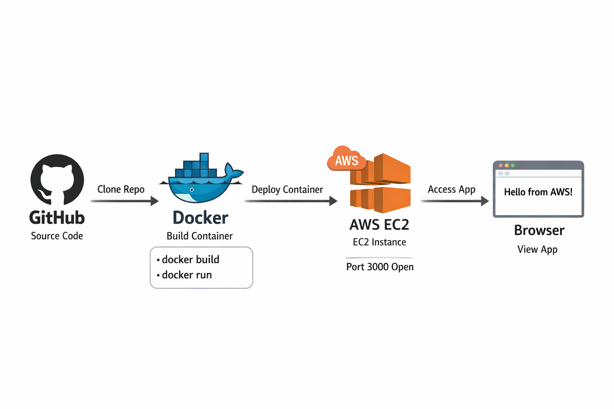

# 🚀 AWS Beginner Lab: Deploy a Simple Web App with Docker on EC2 from GitHub

### Goal: 

#### Deploy a simple “Hello World” Node.js web app from a GitHub repository, containerize it with Docker, and run it on an AWS EC2 instance.

### 🖼️ AWS Visual Architecture Diagram

Here’s a simple beginner-level diagram for this lab:

```
      GitHub Repo
          |
          |  git clone
          v
       AWS EC2
   +---------------+
   |  Docker Engine |
   |  Node.js App   |
   +---------------+
          |
      Port 3000
          |
          v
       Browser
```

### Deploying a Dockerized app on AWS


### Docker deployment flowchart overview



### Explanation of Flow:

- GitHub Repo → stores your Node.js app and Dockerfile.

- EC2 Instance → host machine in AWS.

- Docker Engine → containerizes and runs your app.

- Browser → access app via EC2 public IP + mapped port (3000).

### Step 0: Prerequisites

- AWS account (with permissions to create EC2, Security Groups, and IAM user if needed)

- GitHub account

- Local machine with Git installed

- Basic terminal knowledge

## AWS Beginner Lab: Deploy a Node.js App with Docker on EC2 from GitHub

### 1️⃣ Create a GitHub Repository

- Go to GitHub  → log in.

- Click New Repository (green button on the top right).

- Set repository Name → aws-docker-lab.

- Optional: add a Description → “Simple Node.js Docker Lab”.

- Repository Type → Public or Private.

- Do not check “Initialize this repository with a README” (or you can, it’s optional but helpful).

- Click Create Repository.

### 2️⃣ Create Node.js App on Your Local Machine

### 1️⃣ Create a Project Folder

- Open File Explorer (Windows) or Finder (Mac) or terminal.

- Create a folder called aws-docker-lab.

#### ✅ Windows Example:

```
mkdir aws-docker-lab
cd aws-docker-lab
```

#### ✅ Mac/Linux Example:

```
mkdir ~/aws-docker-lab
cd ~/aws-docker-lab
```

### 2️⃣ Create server.js

Inside that folder, create a file called server.js.

#### ✅ On Windows, 

- right-click → New → Text Document → rename to server.js

#### ✅ On Mac/Linux, use:

```
touch server.js
```

- Open the file in a code editor (VS Code, Sublime Text, Notepad++).

#### ✅ Paste this following code:

```
const express = require('express');
const app = express();
const port = 3000;

app.get('/', (req, res) => {
  res.send('Hello from AWS EC2 + Docker!');
});

app.listen(port, () => {
  console.log(`App running at http://localhost:${port}`);
});
```

### 3️⃣ Create package.json

> **This file tells Node.js what dependencies the app needs.**

- Create a file called package.json in the same folder.

#### ✅ Add this content:

```
{
  "name": "aws-docker-lab",
  "version": "1.0.0",
  "main": "server.js",
  "dependencies": {
    "express": "^4.18.2"
  },
  "scripts": {
    "start": "node server.js"
  }
}
```

### 4️⃣ Initialize Git (Optional, but needed for GitHub)

### 1️⃣ Upload Your Project Folder via GitHub APP

- Open terminal in your project folder.

```
git init
git add .
git commit -m "Initial Node.js app"
```

### 2️⃣ Upload Your Project Folder via GitHub Web

- Go to your newly created repository page.

- Click Add File → Upload Files.

- On your computer, open the aws-docker-lab folder.

- Drag and drop all files inside the folder (not the folder itself) into GitHub.

  - So, upload server.js, package.json, and later Dockerfile.

- Scroll down, enter a commit message like Initial Node.js app.

- Click Commit changes.

#### ✅ Now your project is on GitHub, and the repository contains all the files needed.

### 📢 Important Notes:

You do not need to upload the folder itself, only the contents of the folder.

#### Your repository on GitHub should now look like this:

```
aws-docker-lab/
├── server.js
├── package.json
```

- Later, you can add the Dockerfile the same way:
Add File → Upload Files → Commit.

### ✅ Result on your local machine

Your folder structure should look like this:

```
aws-docker-lab/
├── server.js
├── package.json
```

At this point, your Node.js app is ready locally.

Next, you will push it to GitHub, so EC2 can pull it and run it with Docker.

