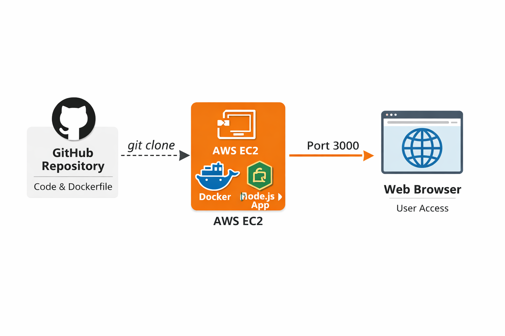

# 🚀 AWS Beginner Lab: Deploy a Simple Web App with Docker on EC2 from GitHub

### Goal: 

#### Deploy a simple “Hello World” Node.js web app from a GitHub repository, containerize it with Docker, and run it on an AWS EC2 instance.

### 🖼️ AWS Visual Architecture Diagram

Here’s a simple beginner-level diagram for this lab:

```
      GitHub Repo
          |
          |  git clone
          v
       AWS EC2
   +---------------+
   |  Docker Engine |
   |  Node.js App   |
   +---------------+
          |
      Port 3000
          |
          v
       Browser
```

### Deploying a Dockerized app on AWS



### Explanation of Flow:

- GitHub Repo → stores your Node.js app and Dockerfile.

- EC2 Instance → host machine in AWS.

- Docker Engine → containerizes and runs your app.

- Browser → access app via EC2 public IP + mapped port (3000).

### Step 0: Prerequisites

- AWS account (with permissions to create EC2, Security Groups, and IAM user if needed)

- GitHub account

- Local machine with Git installed

- Basic terminal knowledge

### Step 1: Create a Simple Web App in GitHub

- Go to GitHub → New Repository → Name it aws-docker-lab.

- Create a Node.js app with this minimal server.js file:

```
const express = require('express');
const app = express();
const port = 3000;

app.get('/', (req, res) => {
  res.send('Hello from AWS EC2 + Docker!');
});

app.listen(port, () => {
  console.log(`App running at http://localhost:${port}`);
});
```

- Add a package.json:

```
{
  "name": "aws-docker-lab",
  "version": "1.0.0",
  "main": "server.js",
  "dependencies": {
    "express": "^4.18.2"
  },
  "scripts": {
    "start": "node server.js"
  }
}
```

- Commit and push your code to GitHub.

### Step 2: Create a Dockerfile

- Add a Dockerfile in your repo root:

```
# Use Node.js official image
FROM node:18

# Set working directory
WORKDIR /app

# Copy package.json and install dependencies
COPY package*.json ./
RUN npm install

# Copy all source files
COPY . .

# Expose port
EXPOSE 3000

# Command to run app
CMD ["npm", "start"]
```

Commit and push this Dockerfile to GitHub.

### Step 3: Launch an AWS EC2 Instance

- Log in to AWS → EC2 → Launch Instance

    - AMI: Amazon Linux 2023 or Ubuntu 22.04

    - Instance Type: t2.micro (free tier)

    - Key Pair: Create or use existing .pem key

    - Security Group: Allow ports:

        - 22 (SSH)

        - 3000 (Web app)

- Launch the instance.

### Step 4: Connect to EC2

From your terminal:

```
chmod 400 my-key.pem   # Make key secure
ssh -i my-key.pem ec2-user@<EC2_PUBLIC_IP>
```

- For Ubuntu, use ubuntu@<EC2_PUBLIC_IP> instead of ec2-user.

### Step 5: Install Docker on EC2

Run the following:

For Amazon Linux:

```
sudo yum update -y
sudo amazon-linux-extras install docker -y
sudo service docker start
sudo usermod -a -G docker ec2-user
```

- Logout & login again to apply Docker permissions.

- Verify with docker --version.

### Step 6: Clone Your GitHub Repository

```
git clone https://github.com/<your-username>/aws-docker-lab.git
cd aws-docker-lab
```

### Step 7: Build and Run the Docker Container

```
docker build -t aws-docker-lab .
docker run -d -p 3000:3000 aws-docker-lab
```

- -d → run in detached mode

- -p 3000:3000 → map container port 3000 to EC2 port 3000

### Step 8: Access Your App

Open browser → http://<EC2_PUBLIC_IP>:3000

You should see:

```
Hello from AWS EC2 + Docker!
```

### Step 9 (Optional): Automate with Docker Compose

If you want to expand later, you can add a docker-compose.yml:

```
version: "3.8"
services:
  web:
    build: .
    ports:
      - "3000:3000"
```

Run it with:

```
docker-compose up -d
```

### Step 10: Notes and Learning Outcomes

✅ Learned how to:

- Clone GitHub repo on EC2

- Build and run a Docker container on AWS EC2

- Map container ports and access publicly

- Simple Node.js app deployment

- Security group port management

