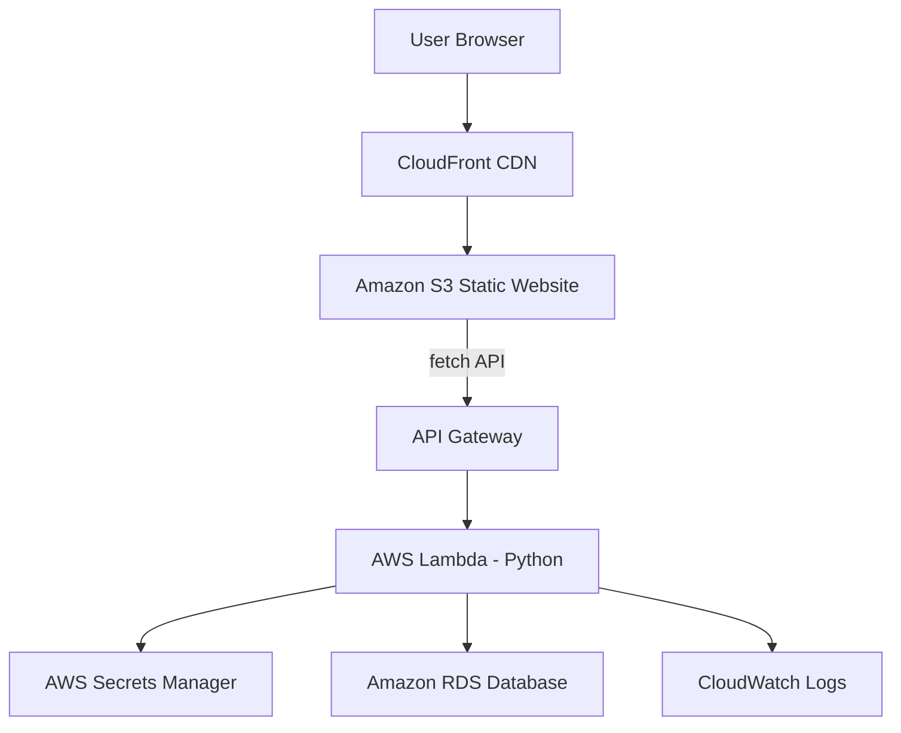

# AWS Serverless Lab: API Gateway + Lambda + Secrets Manager

## 1. Architecture Overview

```
User Browser
    ↓
CloudFront CDN
    ↓
S3 Bucket (Static Website: index.html + JS)
    ↓
API Gateway (/products)
    ↓
Lambda (Python Function)
    ↓
Secrets Manager (DB Credentials)
    ↓
Amazon RDS (MySQL/PostgreSQL)
```
### Architecture Visual Diagram


## 2. Step-by-Step Implementation

### Step 1: RDS Setup
- Launch RDS instance (MySQL/PostgreSQL).
- Configure security groups to allow Lambda access only.

### Step 2: Secrets Manager
- Create a secret to store DB credentials (host, username, password, dbname, port).
- Example secret name: `rds/ecommerce/db`

### Step 3: Lambda IAM Role
- Create `lambda-rds-secret-role`.
- Attach `AWSLambdaBasicExecutionRole`.
- Add custom policy to allow `secretsmanager:GetSecretValue` on your secret.

### Step 4: Lambda Function (Python)
- Runtime: Python 3.10
- Add VPC/subnets if RDS is private.
- Add PyMySQL via Lambda Layer.

Example Lambda code:
```python
import json
import pymysql
import boto3

def get_secret():
    client = boto3.client('secretsmanager')
    response = client.get_secret_value(SecretId='rds/ecommerce/db')
    return json.loads(response['SecretString'])

def lambda_handler(event, context):
    secret = get_secret()

    conn = pymysql.connect(
        host=secret['host'],
        user=secret['username'],
        password=secret['password'],
        database=secret['dbname']
    )

    cursor = conn.cursor()
    cursor.execute("SELECT * FROM products")
    rows = cursor.fetchall()

    return {
        "statusCode": 200,
        "headers": {"Access-Control-Allow-Origin": "*"},
        "body": json.dumps(rows)
    }
```

### Step 5: API Gateway Setup
- Create REST API.
- Create resource `/products` and method GET.
- Integrate with Lambda (Lambda Proxy).
- Enable CORS.
- Deploy stage `prod`.
- Copy Invoke URL for frontend use.

### Step 6: Frontend Integration
- Update `index.html` fetch URL to API Gateway endpoint:
```js
fetch("https://abc123.execute-api.us-east-1.amazonaws.com/prod/products")
  .then(res => res.json())
  .then(data => console.log(data));
```
- CloudFront serves the static S3 site.

## 3. Test & Verification Checklist

1. **Secrets Manager:** Verify DB credentials exist.
2. **IAM Role:** Lambda has permission to read secrets.
3. **Lambda Test:** Run test event, verify DB data returned.
4. **RDS Connectivity:** Lambda connects and queries RDS successfully.
5. **API Gateway Test:** Invoke API in console, check `200 OK`.
6. **Public Endpoint Test:** Access API via browser/curl.
7. **CORS Verification:** Browser fetch works, no CORS errors.
8. **Frontend Integration:** CloudFront site calls API and renders data.
9. **CloudFront Validation:** Confirm headers `Via: CloudFront`, caching works.
10. **Security Tests:** DB not public, no credentials in code, API throttling works.

## 4. Mermaid Diagram


## 5. Notes & Best Practices
- Use HTTPS everywhere.
- RDS in private subnet if possible.
- IAM least privilege for Lambda.
- Lambda scales automatically; no EC2 needed.
- CloudWatch for logs and monitoring.
- No credentials hardcoded in code.

## 6. Professional Summary Statement
> Users access a CloudFront-distributed S3 static website. The frontend communicates with a serverless backend through API Gateway, which invokes a Python Lambda function. The Lambda securely retrieves database credentials from AWS Secrets Manager and interacts with an Amazon RDS instance. Logging and monitoring are handled via CloudWatch.

