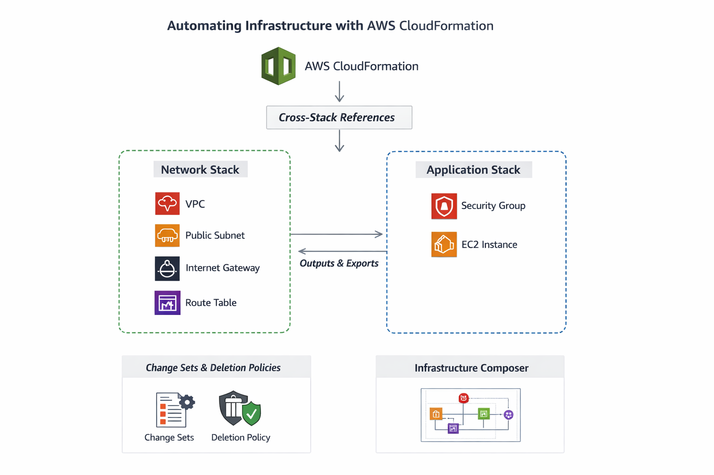

# 📘 AWS CloudFormation Hands-On Lab

> **Author & Architecture Designer: ** Charlie 

## Automating Infrastructure with Infrastructure as Code (IaC)

## 📌 Lab Goal (What You Will Build)

By the end of this lab, you will successfully and confidently:

✅ Understand Infrastructure as Code (IaC)

✅ Create a VPC stack (network layer) using CloudFormation

✅ Create an Application stack that imports values from the network stack

✅ Use Parameters, Outputs, Exports, and Imports

✅ Use Change Sets before updating infrastructure

✅ Use Deletion Policies to protect resources

✅ Visualize infrastructure using Infrastructure Composer

✅ Verify, test, and safely delete stacks

## AWS Architecture Diagram



## 🧠 Prerequisites (Read Carefully)

### 1️⃣ AWS Account

* You must have an AWS Free Tier account
* You must be logged into the AWS Management Console

### 2️⃣ AWS Region

* Use ONE region only (recommended): `us-east-1 (N. Virginia)`

⚠️ Important:

* Do not change regions during this lab.

## 🧩 Architecture Overview

We will deploy infrastructure in layers:

### Layer 1 – Network Stack

* VPC
* Public Subnet
* Internet Gateway
* Route Table

### Layer 2 – Application Stack

* Security Group
* EC2 Instance
* Uses values exported from Network Stack

## 🧱 STEP 1: Understand Infrastructure as Code (IaC)

### What is IaC?

* Infrastructure is defined using code
* Code is Version controlled, Repeatable, Auditable

### Why CloudFormation?

* Define infrastructure using YAML or JSON
* Deploy stacks reliably
* Roll back automatically on failure

## 🧱 STEP 2: Open AWS CloudFormation

1. Login to AWS Console
2. Search for CloudFormation
3. Click CloudFormation
4. You should now see the CloudFormation Dashboard

## 🧱 STEP 3: Create Network Stack (VPC Layer)

### 3.1 Create a New Stack

1. Click Create stack
2. Select With new resources (standard)
3. Under Specify template: Select Upload a template file
4. Click Choose file

## 🧱 STEP 4: Create Network CloudFormation Template

Create a file named: `network-stack.yaml`

### Paste the following FULL TEMPLATE (DO NOT SKIP)

```yaml
AWSTemplateFormatVersion: "2010-09-09"
Description: Network Stack - VPC and Subnet

Resources:
  MyVPC:
    Type: AWS::EC2::VPC
    Properties:
      CidrBlock: 10.0.0.0/16
      EnableDnsSupport: true
      EnableDnsHostnames: true
      Tags:
        - Key: Name
          Value: MyVPC

  InternetGateway:
    Type: AWS::EC2::InternetGateway

  AttachGateway:
    Type: AWS::EC2::VPCGatewayAttachment
    Properties:
      VpcId: !Ref MyVPC
      InternetGatewayId: !Ref InternetGateway

  PublicSubnet:
    Type: AWS::EC2::Subnet
    Properties:
      VpcId: !Ref MyVPC
      CidrBlock: 10.0.1.0/24
      MapPublicIpOnLaunch: true
      AvailabilityZone: !Select [0, !GetAZs ""]

  PublicRouteTable:
    Type: AWS::EC2::RouteTable
    Properties:
      VpcId: !Ref MyVPC

  PublicRoute:
    Type: AWS::EC2::Route
    DependsOn: AttachGateway
    Properties:
      RouteTableId: !Ref PublicRouteTable
      DestinationCidrBlock: 0.0.0.0/0
      GatewayId: !Ref InternetGateway

  SubnetRouteAssociation:
    Type: AWS::EC2::SubnetRouteTableAssociation
    Properties:
      SubnetId: !Ref PublicSubnet
      RouteTableId: !Ref PublicRouteTable

Outputs:
  VPCId:
    Value: !Ref MyVPC
    Export:
      Name: Network-VPC-ID

  PublicSubnetId:
    Value: !Ref PublicSubnet
    Export:
      Name: Network-PublicSubnet-ID
```

## 🧱 STEP 5: Upload & Deploy Network Stack

1. Upload `network-stack.yaml`
2. Click Next
3. Stack name: `network-stack`
4. Click Next
5. Leave all settings default
6. Click Next
7. Click Create stack

✅ Wait until Status = `CREATE_COMPLETE`

## 🧪 STEP 6: Verify Network Stack

* **Check VPC:** Go to VPC Console, Confirm MyVPC exists
* **Check Subnet:** Go to Subnets, Confirm public subnet exists
* **Check Outputs:** Open CloudFormation > network-stack > Outputs tab, Confirm:

  * `Network-VPC-ID`
  * `Network-PublicSubnet-ID`

## 🧱 STEP 7: Create Application Stack

### 7.1 Create Template File: `app-stack.yaml`

## 🧱 STEP 8: Application Stack Template (FULL)

```yaml
AWSTemplateFormatVersion: "2010-09-09"
Description: Application Stack - EC2 Instance

Parameters:
  KeyName:
    Type: AWS::EC2::KeyPair::KeyName
    Description: EC2 KeyPair for SSH

Resources:
  AppSecurityGroup:
    Type: AWS::EC2::SecurityGroup
    Properties:
      GroupDescription: Allow SSH
      VpcId: !ImportValue Network-VPC-ID
      SecurityGroupIngress:
        - IpProtocol: tcp
          FromPort: 22
          ToPort: 22
          CidrIp: 0.0.0.0/0

  AppInstance:
    Type: AWS::EC2::Instance
    Properties:
      InstanceType: t2.micro
      KeyName: !Ref KeyName
      SubnetId: !ImportValue Network-PublicSubnet-ID
      SecurityGroupIds:
        - !Ref AppSecurityGroup
      ImageId: ami-0c02fb55956c7d316
```

## 🧱 STEP 9: Deploy Application Stack

1. Open CloudFormation
2. Click Create stack
3. Upload `app-stack.yaml`
4. Click Next
5. Stack name: `app-stack`
6. Select an existing EC2 Key Pair
7. Click Next
8. Click Create stack

✅ Wait until Status = `CREATE_COMPLETE`

## 🧪 STEP 10: Verify Application Stack

* **Verify EC2:** Go to EC2 Console, Confirm EC2 instance is running and Public IP assigned
* **Verify Security Group:** Port 22 (SSH) allowed

## 🔄 STEP 11: Safe Updates Using Change Sets

1. Select `app-stack` > Create change set
2. Modify instance type (e.g., `t3.micro`)
3. Review what will change
4. Execute change set

✅ Prevents accidental damage

## 🧭 STEP 12: Visualize Architecture (Infrastructure Composer)

1. Open CloudFormation > Infrastructure Composer
2. Load your stack
3. View graphical architecture

## 🛡️ STEP 13: Deletion Policies (Data Protection)

Example:

```yaml
DeletionPolicy: Retain
```

* Prevents accidental deletion of important resources

# ✅ CloudFormation Lab Test & Verification

## 1️⃣ Verify Network Stack (VPC Layer)

**Resources to check:**

* VPC
* Public Subnet
* Internet Gateway
* Route Table
* Outputs (VPC ID & Subnet ID)

**Steps:**

1. Go to **VPC Console → Your VPCs**

   * Check that `MyVPC` exists.
   * Confirm **CIDR block** is `10.0.0.0/16`.
2. Go to **Subnets → Your Subnets**

   * Check that the public subnet exists.
   * Confirm **CIDR block** is `10.0.1.0/24`.
   * Ensure **Auto-assign public IPv4** is enabled.
3. Go to **Internet Gateways → Your Internet Gateways**

   * Confirm the IGW is **attached to MyVPC**.
4. Go to **Route Tables → Your Route Tables**

   * Confirm the public route table exists.
   * Check that it has a **0.0.0.0/0 → IGW** route.
   * Verify **Subnet association** with the public subnet.
5. Check **CloudFormation Outputs**

   * `Network-VPC-ID` and `Network-PublicSubnet-ID` are available.
6. **Test connectivity (Optional)**

   * Create a temporary EC2 in the public subnet and try `ping 8.8.8.8`.

---

## 2️⃣ Verify Application Stack (EC2 Layer)

**Resources to check:**

* Security Group
* EC2 Instance

**Steps:**

1. Go to **EC2 Console → Instances**

   * Instance is **running**.
   * **Public IP** is assigned.
2. Go to **Security Groups**

   * Check that **port 22 (SSH)** is allowed from your IP.
3. Check **CloudFormation Outputs / Imports**

   * Ensure the EC2 subnet uses `Network-PublicSubnet-ID`.
   * Ensure the Security Group is in `Network-VPC-ID`.
4. **SSH Test (Optional)**

   ```bash
   ssh -i your-key.pem ec2-user@<Public-IP>
   ```

   * Confirm you can log in without errors.
5. **Test Internet Access (Optional)**

   ```bash
   ping -c 4 google.com
   ```

   * Confirms IGW & routing are correct.

---

## 3️⃣ Verify Cross-Stack References

* Network stack **exports values**:

  * `Network-VPC-ID`
  * `Network-PublicSubnet-ID`
* Application stack **imports these values correctly**:

  * Security Group VPC ID → Imported VPC ID
  * EC2 Subnet → Imported Public Subnet ID
* In **CloudFormation → app-stack → Resources**

  * No **ImportValue errors**.
* Confirm that deleting **app-stack first** works without errors (then **network-stack** can be deleted safely).

---

## 4️⃣ Verify Change Sets (Safe Updates)

1. Create a **Change Set** in `app-stack`.
2. Modify instance type (t2.micro → t3.micro).
3. Preview the changes.
4. Execute the change set.
5. Verify the EC2 instance type is updated without affecting other resources.

---

## 5️⃣ Verify Deletion Policies

1. Add `DeletionPolicy: Retain` to EC2 or Security Group.
2. Delete the stack.
3. Check that retained resources are **not deleted**.

---

## 6️⃣ Verify Visualization (Infrastructure Composer)

1. Open **CloudFormation → Infrastructure Composer**.
2. Load both stacks.
3. Confirm all resources are correctly visualized:

   * VPC, Subnet, IGW, Route Table
   * Security Group, EC2 Instance
   * Cross-stack links

---

## 7️⃣ Final Verification Checklist

| Resource                | Status                           | Pass? |
| ----------------------- | -------------------------------- | ----- |
| VPC                     | Exists with correct CIDR         | ✅     |
| Public Subnet           | Exists, mapped public IP         | ✅     |
| Internet Gateway        | Attached to VPC                  | ✅     |
| Route Table             | Contains route to IGW            | ✅     |
| CloudFormation Outputs  | All outputs exist                | ✅     |
| EC2 Instance            | Running, public IP assigned      | ✅     |
| Security Group          | Port 22 allowed                  | ✅     |
| Cross-stack References  | Imported correctly               | ✅     |
| Change Set              | Updates instance type safely     | ✅     |
| Deletion Policies       | Resources retained if configured | ✅     |
| Infrastructure Composer | All resources visualized         | ✅     |

> If all of the above pass, your **CloudFormation lab is 100% successful**.


## 🧪  Common Errors & Fixes

| Error             | Cause                     | Solution                   |
| ----------------- | ------------------------- | -------------------------- |
| ImportValue error | Network stack not created | Deploy network stack first |
| AMI error         | Wrong region              | Use correct AMI for region |
| SSH timeout       | SG issue                  | Allow port 22              |
| Stack rollback    | Syntax error              | Validate YAML              |

## 🧹 Clean Up (IMPORTANT)

* Delete **app-stack** first
* Delete **network-stack** next

⚠️ Reverse order causes failure

## 🎓 Final Learning Summary

✔ Infrastructure as Code
✔ Layered architecture
✔ Cross-stack references
✔ Safe updates with Change Sets
✔ Visualization tools
✔ Deletion protection

## 🏆 You Have Successfully Completed This Lab

* AWS re/Start
* DevOps learning
* Cloud Engineer roles
* GitHub portfolio


