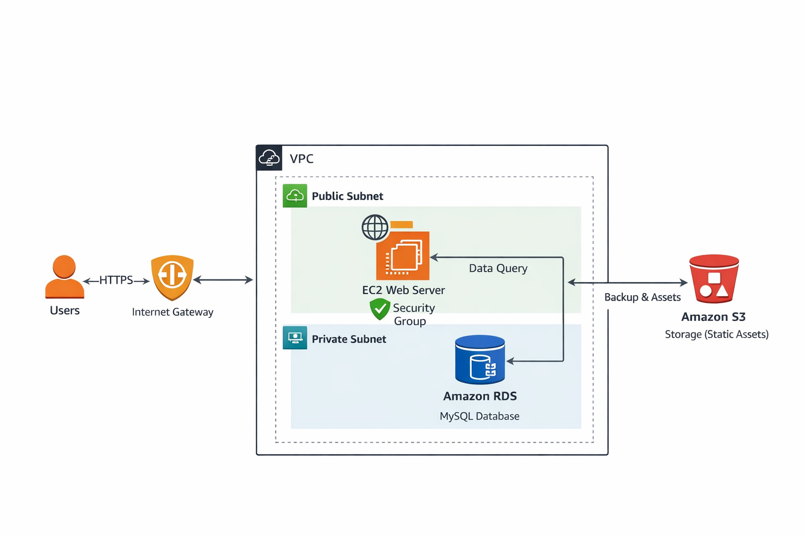

# AWS Hands-On Lab: From PuTTY SSH to CloudFormation 🚀

## Lab Overview
This lab guides you from manually connecting to an EC2 instance using PuTTY to deploying infrastructure using AWS CloudFormation.

---

## AWS Architecture Diagram



## LAB 1: SSH into EC2 Using PuTTY

### Step 1: AWS Setup
- Login to AWS Console
- Select region (e.g. us-east-1)

### Step 2: Create Key Pair
- EC2 → Key Pairs
- Type: RSA
- Format: .ppk
- Download and save

### Step 3: Launch EC2
- AMI: Amazon Linux 2
- Instance Type: t2.micro
- Security Group: Allow SSH (22) from your IP

### Step 4: Connect via PuTTY
Host:
```
ec2-user@<Public-IP>
```
Auth → Load .ppk key → Open

---

## LAB 2: Linux Basics
```bash
whoami
uname -a
df -h
free -m
```

---

## LAB 3: Networking
```bash
ip a
ping google.com
```

---

## LAB 4: IAM Role
- Create EC2 role
- Attach AmazonS3ReadOnlyAccess

Test:
```bash
aws s3 ls
```

---

## LAB 5: Storage (EBS)
```bash
lsblk
sudo mkfs -t xfs /dev/xvdf
sudo mkdir /data
sudo mount /dev/xvdf /data
df -h
```

---

## LAB 6: CloudFormation Automation

```yaml
AWSTemplateFormatVersion: '2010-09-09'
Resources:
  MyEC2Instance:
    Type: AWS::EC2::Instance
    Properties:
      InstanceType: t2.micro
      ImageId: ami-0c02fb55956c7d316
      KeyName: MyKeyPair
```

---

## Outcome
From SSH troubleshooting to Infrastructure as Code using CloudFormation.
